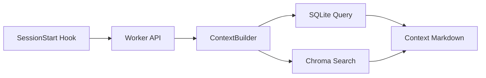

# Karpathy LLM Wiki 对 Agent Recall 的借鉴分析

> 基于 Andrej Karpathy 2026年4月发布的 [LLM Knowledge Bases](https://x.com/karpathy/status/2039805659525644595) 推文及其 [LLM Wiki Gist](https://gist.github.com/karpathy/442a6bf555914893e9891c11519de94f) 的深度技术分析。
> 补充分析了 [ex-brain](https://www.npmjs.com/package/ex-brain)（OceanBase 前端工程师克军基于 Karpathy LLM Wiki + Garry Tan GBrain 启发的实现）。
>
> 分析日期：2026-04-08 / 更新：2026-04-09

---

## 目录

- [一、Karpathy LLM Wiki 概述](#一karpathy-llm-wiki-概述)
  - [核心观点](#核心观点)
  - [三层架构](#三层架构)
  - [三个核心操作](#三个核心操作)
  - [导航文件](#导航文件)
  - [Wiki 页面结构](#wiki-页面结构)
  - [工具栈](#工具栈)
  - [规模化考虑](#规模化考虑)
- [二、社区开源实现](#二社区开源实现)
- [三、Agent Recall 现有架构概要](#三agent-recall-现有架构概要)
- [四、核心定位差异](#四核心定位差异)
- [五、可借鉴方法详解（12项）](#五可借鉴方法详解12项)
  - [1. 知识编译层](#1-知识编译层-compilation-over-retrieval)
  - [2. Wiki-style Index 知识目录索引](#2-wiki-style-index--知识目录索引)
  - [3. Lint 操作 — 知识健康检查](#3-lint-操作--知识健康检查)
  - [4. Confidence Scoring — 置信度标记](#4-confidence-scoring--置信度标记)
  - [5. Query → File Back — 查询结果回写](#5-query--file-back--查询结果回写)
  - [6. Log 活动时间线](#6-log-活动时间线--结构化操作日志)
  - [7. Schema as Living Document](#7-schema-as-living-document--模式即文档)
  - [8. Markdown Export — 可读性出口](#8-obsidianmarkdown-export--可读性出口)
  - [9. 视觉元素 — 图表自动生成](#9-视觉元素--图表自动生成)
  - [10. Source Provenance — 来源溯源](#10-source-provenance--来源溯源)
  - [11. 多输出格式](#11-多输出格式)
  - [12. 小而精的改进点](#12-小而精的改进点)
- [六、ex-brain 补充分析（8项新增借鉴）](#六ex-brain-补充分析8项新增借鉴)
- [七、实施优先级建议（综合）](#七实施优先级建议综合)
- [八、参考资料](#八参考资料)

---

## 一、Karpathy LLM Wiki 概述

### 核心观点

Andrej Karpathy（前 OpenAI、Tesla AI 负责人）分享了他用 LLM 构建个人知识库的工作流。核心洞察：

> "我现在的 token 消耗更多花在**操作知识**而非**操作代码**上。"

**哲学：Compilation Over Retrieval（编译优于检索）**

传统 RAG 的根本缺陷是每次查询都从零开始重新发现知识。RAG 把文档当作临时查询源，而 LLM Wiki 把文档当作**持久化知识库的建筑材料**。

| 方面 | RAG | LLM Wiki |
|------|-----|----------|
| 查询时 | 切片 → 嵌入 → 检索 → 拼接 → 回答 | 读 index → drill down → 合成回答 |
| 知识积累 | 每次查询独立，不积累 | 每个新源强化整体结构，复利增长 |
| 维护成本 | 低（无维护） | LLM 自动维护，人类近乎零成本 |
| 基础设施 | 向量数据库 + embedding pipeline | 纯 Markdown 文件 + LLM |

Karpathy 将其追溯到 Vannevar Bush 1945 年论文 "As We May Think" 中的 Memex 概念。Bush 的愿景未实现的原因是维护关联路径需要人类无法持续承受的繁琐簿记工作。LLM 以近乎零成本解决了这个维护负担。

**核心原则**：人类负责策展、探索、提问；LLM 负责摘要、交叉引用、归档、簿记、维护。

### 三层架构

```
┌─────────────────────────────────────────────────┐
│                   Schema Layer                   │
│  CLAUDE.md / AGENTS.md — 定义结构、约定、工作流   │
├─────────────────────────────────────────────────┤
│                   Wiki Layer                     │
│  wiki/ — LLM 生成和维护的 Markdown 知识页        │
│  ├── index.md        按类别的内容目录             │
│  ├── log.md          追加式活动时间线             │
│  ├── overview.md     全局概览枢纽页               │
│  ├── concepts/       抽象概念页                   │
│  ├── entities/       具体实体页                   │
│  ├── sources/        源文档摘要                   │
│  └── comparisons/    对比分析                     │
├─────────────────────────────────────────────────┤
│                Raw Sources Layer                 │
│  raw/ — 不可变的原始文档（LLM 只读不写）          │
│  ├── articles/                                   │
│  ├── papers/                                     │
│  ├── repos/                                      │
│  ├── data/                                       │
│  └── images/                                     │
└─────────────────────────────────────────────────┘
```

**Layer 1: Raw Sources** — 不可变源文件，保留审计追踪
**Layer 2: The Wiki** — LLM 独占写入、人类只读的知识层
**Layer 3: The Schema** — 因 Agent 而异的项目级指令文件，与使用模式共同演化

### 三个核心操作

#### Ingest（摄入）
1. 从 `raw/` 读取源文件
2. 与用户讨论关键收获
3. 在 `wiki/sources/` 创建/更新摘要页面
4. 更新 `wiki/index.md`
5. 更新相关的 concept 和 entity 页面
6. 追加条目到 `wiki/log.md`

> 单个源的摄入通常触发 **10-15 个** Wiki 页面的级联更新。

#### Query（查询）
1. 读取 `wiki/index.md` 定位相关页面
2. 直接读取那些页面
3. 用 `[[wiki-link]]` 引用合成回答
4. 如果回答有价值，**将其归档为新的 Wiki 页面**

> 探索性查询产生的高质量分析不应丢失在聊天记录中，而应回流为 Wiki 页面，实现知识复利。

#### Lint（维护）
定期健康检查，识别：
1. **Contradictions** — 页面间的冲突信息
2. **Orphan pages** — 没有入链的页面
3. **Missing concept pages** — 被提及但没有专属页面的概念
4. **Stale claims** — 被更新源取代的信息
5. **Data gaps** — 需要进一步调查的方向

### 导航文件

#### index.md（内容目录）
- 按类别组织列出所有 Wiki 页面
- 每页一行摘要 + 可选元数据
- 替代基于嵌入的 RAG — LLM 先读索引再 drill down
- 每次 ingest 后更新

#### log.md（追加式活动时间线）
```markdown
## [2026-04-08] ingest | Source Title
- Created concept page: [Page Title](concepts/page.md)
- Updated entity page: [Page Title](entities/page.md)
- Key takeaway: one sentence summary

## [2026-04-08] query | Question Asked
- Created new page: [Page Title](concepts/page.md)
- Finding: one sentence answer

## [2026-04-08] lint | Health Check
- Fixed contradiction between X and Y
- Added missing cross-reference in Z
```

#### overview.md（枢纽页面）
- Wiki 涵盖范围摘要
- 源数量和页面数量（每次 ingest 后更新）
- Key Findings — 跨所有源的最重要洞察
- Recent Updates — 最近 5-10 个操作

### Wiki 页面结构

#### YAML Frontmatter（必需）
```yaml
---
title: Page Title
type: concept | entity | source-summary | comparison
sources: [list of raw/ files referenced]
related: [list of wiki pages linked]
created: YYYY-MM-DD
updated: YYYY-MM-DD
confidence: high | medium | low
---
```

#### 页面正文规范
每个 Wiki 页面必须包含：
1. **TLDR** — 单句摘要
2. **正文** — 使用 `[[wiki-link]]` 的交叉引用
3. **反论/数据缺口** — 声明的局限性
4. **源引用** — 脚注链接回 raw 文档

引用格式：
```markdown
Transformers use self-attention[^1] that scales quadratically[^2].

[^1]: attention-paper.pdf, p.3
[^2]: scaling-laws.pdf, p.12-14
```

### 工具栈

| 工具 | 用途 |
|------|------|
| **Obsidian** | 主 IDE — 存储 Markdown + 图片，Graph View 可视化知识关系 |
| **Obsidian Web Clipper** | 将网页文章转为 Markdown，下载图片到 `raw/assets/` |
| **Obsidian Dataview** | 将 vault 当作可查询数据库（SQL 风格） |
| **Claude Code / Codex** | LLM 引擎 — 编译、查询、维护 Wiki |
| **qmd** | 本地 Markdown 搜索引擎 — BM25 + 向量语义 + LLM 重排序，支持 MCP server |
| **Marp** | 从 Wiki 内容生成幻灯片（HTML/PDF/PowerPoint） |
| **matplotlib** | 数据可视化，图表嵌入 Wiki 页面 |
| **Git** | 纯 Markdown 使完整版本控制可用 |

#### qmd 搜索引擎
```bash
qmd search "mixture of experts"      # BM25 全文搜索
qmd vsearch "sparse model load"      # 向量语义搜索
qmd query "routing tradeoffs"        # LLM 重排序的混合搜索
```
- 所有处理本地完成（node-llama-cpp + GGUF 模型），无需 API
- CLI + MCP server 模式
- Wiki 增长到数百页以上时启用

### 规模化考虑

- 简单设置在 ~100 页后开始需要更多结构
- 需要预先规划：标签系统、文件夹结构、搜索系统
- 超过数百页时使用 qmd 进行语义导航
- 定期 lint 防止知识累积衰退
- 不维护的 Wiki 会积累矛盾和孤页

---

## 二、社区开源实现

| 项目 | 特点 | 技术栈 | Stars |
|------|------|--------|-------|
| [lucasastorian/llmwiki](https://github.com/lucasastorian/llmwiki) | 最完整的 SaaS 实现，Web UI + MCP tools + PostgreSQL + S3 | Next.js 16 + FastAPI + Supabase | 37 |
| [Ss1024sS/LLM-wiki](https://github.com/Ss1024sS/LLM-wiki) | 通用版，支持任何 AI，带 bootstrap 脚本 | Python + Shell | 16 |
| [aarora79/personal-knowledge-base](https://github.com/aarora79/personal-knowledge-base) | Claude Skill 驱动，raw→wiki→query + 概念图可视化 | Claude Code Skill | — |
| [rohitg00 扩展版](https://gist.github.com/rohitg00/2067ab416f7bbe447c1977edaaa681e2) | 加入 memory lifecycle、知识图谱、多 agent 协作、隐私治理 | 概念设计 | — |

### lucasastorian/llmwiki 架构详情

```
Next.js 16 Frontend ──> FastAPI Backend ──> Supabase (Postgres + RLS)
                              │
                        MCP Server ◄──── Claude
```

**核心数据库表**：users, api_keys, knowledge_bases, documents, document_pages, document_chunks

**MCP 工具（5个）**：
1. `guide` — 入口，返回使用指南 + 知识库列表
2. `search` — 浏览（glob 模式）+ 关键词搜索（PGroonga）
3. `read` — 文档读取，支持页码范围、section 提取、图片嵌入
4. `write` — 创建页面、精确文本替换、追加内容
5. `delete` — 软删除/归档（overview.md 和 log.md 受保护）

---

## 三、Agent Recall 现有架构概要

```
┌──────────────────────────────────────────────────┐
│              5 Lifecycle Hooks                     │
│  SessionStart → UserPromptSubmit → PostToolUse    │
│  → Stop(Summarize) → SessionEnd                   │
├──────────────────────────────────────────────────┤
│              Worker Service (port 37777)           │
│  Express API → SessionManager → SDKAgent          │
│  → SearchManager → ContextBuilder                 │
├──────────────────────────────────────────────────┤
│              Storage Layer                         │
│  SQLite (observations, memories, sessions,        │
│   overviews, agent_profiles, active_tasks)        │
│  + Chroma Vector DB (semantic search)             │
├──────────────────────────────────────────────────┤
│              Skills & UI                           │
│  Bootstrap Skill (3-round interview)              │
│  Mem-Search Skill (3-layer search workflow)       │
│  Viewer UI (React, http://localhost:37777)        │
└──────────────────────────────────────────────────┘
```

**数据流**：
1. **PostToolUse** → 捕获工具调用 → 存 observations 表
2. **SDK Agent** → 实时压缩 XML（type, title, facts, concepts, files）
3. **Stop** → 生成 session summary → 存 overviews 表
4. **SessionStart** → ContextBuilder 查询 observations + summaries → 注入上下文
5. **ChromaSync** → 异步同步 observations 到向量数据库

---

## 四、核心定位差异

| 维度 | LLM Wiki | Agent Recall |
|------|----------|--------------|
| **目标** | 研究知识编译系统 | 工作记忆持久化系统 |
| **知识流向** | 外部素材 → 编译 → 结构化 wiki | 工具使用 → 压缩 → 观察记录 |
| **用户角色** | 策展人（主动喂料） | 被动受益者（自动记录） |
| **LLM 角色** | 编译器 + 维护者 | 观察者 + 压缩器 |
| **存储形式** | Markdown 文件（纯文本） | SQLite + Chroma（结构化数据库） |
| **检索策略** | index → drill down → 精确读取 | 时间线推送 + 语义搜索 |
| **知识维护** | ingest/query/lint 三循环 | 仅存储和检索，无维护 |
| **版本控制** | Git（纯 Markdown 天然支持） | 无（数据库不易 diff） |
| **可视化** | Obsidian Graph View | Viewer UI 时间线 |

---

## 五、可借鉴方法详解（12项）

### 1. 知识编译层 (Compilation Over Retrieval)

**现状**：Agent Recall 的 observations 是扁平时间线记录。查询时从 SQLite/Chroma 检索原始观察，拼接后注入上下文。每次查询独立，知识不积累。

**借鉴**：增加一个 **compiled knowledge 层**，定期让 LLM 把同一项目的多个 observations 编译成结构化的"项目知识页"。

```
现有流程：  观察 → 压缩 → 存储 → 检索 → 注入上下文

借鉴后：    观察 → 压缩 → 存储 ─┬→ 检索 → 注入上下文
                                │
                                └→ 定期编译 → 知识页 ─→ 优先注入
                                       ↑
                                   新的编译层
```

**具体做法**：
- 新建 `compiled_knowledge` 表，按项目 + 主题存储编译后的 Markdown 页面
- 后台定时任务：当某项目积累 N 条新 observations 后，触发编译
- 编译产出：项目架构认知、常见模式、关键决策历史、文件关系图
- 上下文注入时**优先读编译页**，而非每次重新拼接原始 observations

**价值**：解决"100 条 observations 但上下文窗口只能放 20 条"的根本矛盾。编译后的知识密度远高于原始记录。

**预估复杂度**：中高 — 需要新的 DB 表、编译 prompt、后台任务调度、ContextBuilder 改造

---

### 2. Wiki-style Index — 知识目录索引

**现状**：ContextBuilder 按时间线渲染 observations，没有按主题/概念索引。搜索要么全文，要么语义。

**借鉴**：引入 **index 概念** — 每个项目自动维护的"知识目录"。

**具体做法**：
- 每个项目维护一个虚拟 `index`（存在 DB 或 Markdown 中）
- 内容结构：
  ```markdown
  ## Project: agent-recall

  ### Architecture
  - Worker service on port 37777 (5 observations)
  - 5 lifecycle hooks: SessionStart, UserPromptSubmit... (3 observations)

  ### Key Decisions
  - Switched from transcript-based to SDK streaming (2 observations)
  - Added multi-provider support (1 observation)

  ### Active Issues
  - Stale generator detection needs tuning (1 observation)
  ```
- LLM Agent 在 SessionStart 时先读 index，再决定需要检索哪些具体 observations
- 类似 Karpathy 的"LLM 先读 index.md 的 TLDR，再 drill down 到具体页面"

**价值**：上下文注入从"推最近 N 条"变成"按需拉取相关内容"，大幅提高信噪比。

**预估复杂度**：中 — 需要 index 生成/更新逻辑、ContextBuilder 改造

---

### 3. Lint 操作 — 知识健康检查

**现状**：Agent Recall 只有存储和检索，没有知识质量维护。旧 observations 可能与新的矛盾，但系统不会发现。

**借鉴**：增加定期 Lint 机制。

**具体做法**：

| Lint 类型 | 检测方法 | 处理方式 |
|-----------|---------|---------|
| **矛盾检测** | 同一文件的不同 observations 声明矛盾事实 | 标记冲突，保留最新 |
| **陈旧标记** | 文件被大幅修改后，相关旧 observations | 标记为 `stale`，降权 |
| **孤立清理** | 没有后续引用的古老记录 | 降低检索权重 |
| **重复合并** | 多条 observations 表达同一事实 | 合并为最精确版本 |

- 作为 worker 后台任务，低优先级运行
- 新增 `staleness_score` 字段到 observations 表
- 检索时综合 `relevance_score * (1 - staleness_score)` 排序

**价值**：防止"记忆污染" — 过时信息误导后续工作。

**预估复杂度**：中 — 需要 lint 逻辑（可用 LLM 驱动）、DB 字段扩展、检索权重调整

---

### 4. Confidence Scoring — 置信度标记

**现状**：所有 observations 同等权重。

**借鉴**：LLM Wiki 给每个页面标记 `confidence: high | medium | low`。

**具体做法**：
- 压缩 observations 时让 SDK Agent 额外输出 confidence 字段
- 判断依据：
  - **high** — 直接观察到的事实（如读文件内容、运行测试结果）
  - **medium** — 从工具输出推断的结论
  - **low** — 间接或不确定的信息
- 上下文注入时，低置信度记录降权或标注 `[unverified]`
- Lint 时优先检查低置信度条目

**XML 扩展**：
```xml
<observation>
  <type>discovery</type>
  <confidence>medium</confidence>   <!-- 新增字段 -->
  <title>...</title>
  ...
</observation>
```

**价值**：小改动，大收益。避免 LLM 在上下文中看到不确定信息时过度信任。

**预估复杂度**：低 — 仅需修改 SDK prompt + DB 字段 + ContextBuilder 渲染

---

### 5. Query → File Back — 查询结果回写

**现状**：mem-search 返回搜索结果后，结果消失在聊天记录中。

**借鉴**：Karpathy 的核心设计 — 有价值的查询结果应自动存回知识库。

**具体做法**：
- 当用户通过 mem-search 进行复杂查询，且 LLM 合成了有价值的分析时
- 自动（或提示用户确认后）将分析存为新的 observation
- 新增 observation type: `synthesis`
- 合成 observation 标记来源：`origin: 'query'`
- 这样后续查询可以复用这个合成结果

**API 扩展**：
```
POST /api/observations/synthesize
{
  "project": "agent-recall",
  "query": "What were all the architecture decisions?",
  "synthesis": "The project made 3 key decisions: ...",
  "source_observation_ids": [12, 45, 67]
}
```

**价值**：打破"查询是一次性的"瓶颈，让搜索行为也贡献知识。

**预估复杂度**：低中 — 需要新 API endpoint、observation type 扩展、mem-search skill 改造

---

### 6. Log 活动时间线 — 结构化操作日志

**现状**：`overviews` 表存 session summaries，但格式各异，不易机器解析。

**借鉴**：LLM Wiki 的 `log.md` — 严格格式的追加式时间线。

**具体做法**：
- 新增 `activity_log` 表：
  ```sql
  CREATE TABLE activity_log (
    id INTEGER PRIMARY KEY,
    project TEXT NOT NULL,
    timestamp TEXT NOT NULL,        -- ISO 8601
    operation TEXT NOT NULL,         -- session, ingest, query, lint, bootstrap
    title TEXT NOT NULL,
    summary TEXT,                    -- one-line summary
    affected_pages TEXT              -- JSON array of affected observation IDs
  );
  ```
- 每次 session 结束、每次查询、每次 lint 自动追加
- SessionStart 时读最近 N 条 log，快速重建"最近发生了什么"
- 比完整 observations 轻量得多

**价值**：适合快速扫描上下文恢复，不需要读完整 observations 就能理解项目近况。

**预估复杂度**：低 — 新表 + 各操作点追加写入

---

### 7. Schema as Living Document — 模式即文档

**现状**：CLAUDE.md 是静态的项目说明。

**借鉴**：Karpathy 将 schema 定义为"与使用模式共同演化的活文档"。

**具体做法**：
- 让 Agent Recall 自动学习项目的使用模式
- 在 `agent_profiles` 表中增加 `project_schema` 类型
- 自动积累的内容示例：
  - 检测到某项目频繁涉及数据库迁移 → 标记"注意 migration 文件"
  - 检测到某项目测试覆盖率是 CI 关键 → 标记"修改后运行测试"
  - 检测到某项目有特定的代码风格 → 记录风格约定
- 上下文注入时附带项目 schema，实现项目定制化

**价值**：上下文注入从通用变成项目定制化，Agent 能更好地理解每个项目的独特需求。

**预估复杂度**：中 — 需要 pattern 检测逻辑、profile type 扩展、ContextBuilder 集成

---

### 8. Obsidian/Markdown Export — 可读性出口

**现状**：所有数据锁在 SQLite 里，只能通过 Viewer UI 或 API 访问。

**借鉴**：Karpathy 全栈 Markdown，支持 Obsidian Graph View、Git 版本控制。

**具体做法**：
- 增加 `export` 命令/API endpoint：
  ```
  GET /api/export?project=agent-recall&format=obsidian
  ```
- 导出目录结构：
  ```
  export/agent-recall/
  ├── index.md            # 自动生成的目录
  ├── sessions/           # 按日期的 session summaries
  │   ├── 2026-04-08.md
  │   └── 2026-04-07.md
  ├── observations/       # 按类型分组
  │   ├── decisions/
  │   ├── discoveries/
  │   └── changes/
  ├── knowledge/          # 编译后的知识页（如果有）
  └── log.md              # 活动时间线
  ```
- 支持 `[[wiki-link]]` 交叉引用，可直接用 Obsidian 打开
- 支持增量导出（只导出上次以来的变更）

**价值**：降低锁定效应，Markdown 天然对 LLM 友好。Obsidian Graph View 可视化知识关系是强大的差异化特性。

**预估复杂度**：中 — 需要导出逻辑、Markdown 渲染器、增量机制

---

### 9. 视觉元素 — 图表自动生成

**现状**：observations 全是纯文本。

**借鉴**：LLM Wiki 强制每页至少一个视觉元素（Mermaid 图表、表格、SVG）。

**具体做法**：
- 在编译知识页时，自动生成 Mermaid 图表：
  - **文件依赖关系图** — 从 `files_read` / `files_modified` 提取
  - **架构组件图** — 从 observations 中的架构发现编译
  - **决策时间线** — 从 type=decision 的 observations 生成
- Viewer UI 集成 Mermaid 渲染
- 编译页面包含嵌入的图表代码块

**Mermaid 示例**：


**价值**：视觉化大幅提升知识的可理解性，也是 Viewer UI 的差异化特性。

**预估复杂度**：中 — 需要图表生成 prompt、Viewer UI Mermaid 渲染集成

---

### 10. Source Provenance — 来源溯源

**现状**：observations 记录了 `files_read` 和 `files_modified`，但没有精确到行号或具体声明。

**借鉴**：LLM Wiki 的脚注系统 — 每个事实声明链接回原始源的具体位置。

**具体做法**：
- observations 的 `facts` 字段从纯字符串数组扩展为结构化数组：
  ```json
  {
    "facts": [
      {
        "text": "Worker service listens on port 37777",
        "source_file": "src/services/worker-service.ts",
        "source_line": 42,
        "confidence": "high"
      }
    ]
  }
  ```
- 查询时可以追溯："这个事实是从哪次工具调用中发现的？"
- Viewer UI 可以从 fact 跳转到原始 observation

**价值**：解决"我记得有这个信息，但不确定来源是否可靠"的问题。

**预估复杂度**：中 — 需要 SDK prompt 改造、facts 数据结构变更、UI 改造

---

### 11. 多输出格式

**现状**：输出只有上下文 Markdown 和 Viewer UI。

**借鉴**：Karpathy 支持 Marp 幻灯片、matplotlib 图表、新 Markdown 页面。

**具体做法**：
- mem-search 支持指定输出格式：
  ```
  GET /api/export/slides?project=agent-recall&topic=architecture
  GET /api/export/timeline?project=agent-recall&from=2026-04-01
  GET /api/export/weekly-report?project=agent-recall
  ```
- 输出格式：
  - **Marp 幻灯片** — 适合项目汇报
  - **Timeline HTML** — 可视化活动历史
  - **Weekly Report Markdown** — 周报模板自动填充

**价值**：结合 Eli 的高频任务（周报、进度汇总），知识库直接服务于日常输出。

**预估复杂度**：中 — 每种格式需要独立的渲染模板

---

### 12. 小而精的改进点

| 借鉴点 | 当前状态 | 改进 | 复杂度 |
|--------|---------|------|--------|
| **Frontmatter 元数据** | observations 只有类型和日期 | 增加 `confidence`、`related_observations`、`tags` | 低 |
| **交叉引用** | 无 | observations 之间支持 `related_to` 字段，形成知识图谱 | 低 |
| **Git 提交信息格式** | 无 | 按 `ingest:`, `query:`, `lint:` 前缀标准化 session 标题 | 极低 |
| **受保护页面** | 无 | 编译后的知识页标记为 `protected`，lint 时不自动修改 | 低 |
| **批量摄入** | 逐条处理 | 支持 batch ingest — 一次会话多个 observations 统一编译 | 中 |
| **Dataview 式查询** | 只有全文/语义搜索 | 支持结构化查询 API：类型 + 概念 + 文件 + 日期组合过滤 | 低 |

---

## 六、ex-brain 补充分析（8项新增借鉴）

> **来源**：[微信公众号文章](https://mp.weixin.qq.com/s/Dm7b0cClpIC1qYgwIbhyXQ)（OceanBase 技术博客，作者：克军，OceanBase 前端工程师）
>
> ex-brain 是在 Karpathy LLM Wiki 和 Garry Tan GBrain 基础上的进一步实现。npm 包：[ex-brain](https://www.npmjs.com/package/ex-brain)（v0.2.1，Proprietary 许可），底层使用 [seekdb](https://github.com/oceanbase/seekdb)（OceanBase 的 AI 原生混合搜索数据库）。

### ex-brain 核心理念

> "知识库应该像人脑一样——每次写入新信息都自动'更新'认知。"

ex-brain 引入了 **Compiled Truth（编译后的真相）** 概念。与 Karpathy 的 LLM Wiki 相比，它进一步解决了：
- 信息的**时效性分类**（哪些会过期，哪些不会）
- **时间线自动抽取**（事件的时间维度）
- **实体关联自动生长**（知识图谱的自动构建）

### 13. Compiled Truth — 信息分类编译策略

**与第1项"知识编译层"的关系**：这是知识编译层的**具体实现方案**。

**现状**：Agent Recall 的 observations 全部同质化存储和处理。

**ex-brain 的做法**：编译时先让 LLM 判断信息类型，再按类型选择不同策略：

| 信息类型 | 示例 | 处理方式 | 生命周期 |
|---------|------|---------|---------|
| **状态类** | 融资阶段、CEO、团队规模 | 直接**替换**，旧值归入 History | 会"过期" |
| **事实类** | 成立年份、行业、技术栈 | **追加**，不删旧的 | 不会过期 |
| **事件类** | 产品发布、合并、里程碑 | 记入 Status + **时间线** | 永久 |

编译后的输出结构：
```markdown
## Status
- **Funding Stage**: Series A (Source: meeting_notes, 2024-05-20)
- **Valuation**: ~$50M

## History
- 之前是 Seed（到 2024-05-20 为止）

## Facts
- A 轮领投方是 Sequoia
- 2020 年成立的
```

**对 Agent Recall 的借鉴**：
- 让 SDK Agent 在压缩 observations 时判断每条 fact 的类型（状态/事实/事件）
- 编译层按类型采用不同策略：状态类替换、事实类追加、事件类归时间线
- 这比简单的"把所有 observations 合并成一页"精确得多

**预估复杂度**：中 — 需要 SDK prompt 扩展 + 编译策略逻辑

---

### 14. 时间线自动抽取

**现状**：Agent Recall 的 observations 有 `created_at`（记录时间），但没有"这条观察描述的事件发生在什么时候"（语义时间）。

**ex-brain 的做法**：
- 每次 compile 自动从文本中提取时间事件
- 独立存储在 `timeline_entries` 表
- 支持多种日期格式：ISO、中文、英文、相对日期（"last week"）
- 编译与时间线抽取深度集成，不是独立功能

**对 Agent Recall 的借鉴**：
- observations 表增加 `event_date` 字段，区分"记录时间"和"事件时间"
- 对 type=decision 的 observations 特别有价值：决策是什么时候做的，vs 什么时候被记录
- timeline 视图可以按事件时间而非记录时间排序

**预估复杂度**：低 — DB 字段扩展 + SDK prompt 小改

---

### 15. 自动实体关联（Entity Linking）

**现状**：observations 之间没有显式关联。概念通过 `concepts` 字段隐式关联，但没有结构化的关系。

**ex-brain 的做法**：
- 独立的 `links` 表存储实体关系
- LLM 自动识别关系类型：`founder_of`、`invested_in`、`competitor_of`
- 发现新实体时自动创建页面
- 关系是双向的：A → B 时，B 的页面也更新

**对 Agent Recall 的借鉴**：
```sql
CREATE TABLE observation_links (
  id INTEGER PRIMARY KEY,
  source_id INTEGER REFERENCES observations(id),
  target_id INTEGER REFERENCES observations(id),
  relation TEXT NOT NULL,  -- 'relates_to', 'supersedes', 'contradicts', 'builds_on'
  auto_detected BOOLEAN DEFAULT TRUE,
  created_at TEXT DEFAULT (datetime('now'))
);
```

- 当新 observation 涉及与旧 observation 相同的文件或概念时，自动建立 `relates_to` 关联
- 当新 observation 明确更新了旧信息时，标记为 `supersedes`
- ContextBuilder 可以利用关联图谱做更智能的上下文检索：找到一个相关 observation 后，沿关联链拉取更多上下文

**预估复杂度**：中 — 需要新表 + 关联检测逻辑 + ContextBuilder 改造

---

### 16. 混合搜索多维加权

**现状**：Chroma 搜索是纯语义相似度（cosine distance）排序。SQLite 搜索是纯时间/过滤排序。

**ex-brain 的做法**：
```
final_score = semantic_match × 0.85 + freshness × 0.10 + type_weight × 0.05
```
- 语义匹配占主导（85%）
- 新鲜度加成（10%）— 最近更新的内容优先
- 类型权重（5%）— 人物/决策类通常更值得关注

**对 Agent Recall 的借鉴**：
在 SearchOrchestrator 中实现多维加权：
```typescript
function computeFinalScore(hit: SearchHit): number {
  const semanticScore = 1 - hit.chromaDistance; // 0-1
  const daysSinceCreated = daysBetween(hit.created_at, now);
  const freshnessScore = Math.max(0, 1 - daysSinceCreated / 365);
  const typeWeight = TYPE_WEIGHTS[hit.type] || 0.5; // decision=1.0, discovery=0.8, change=0.6

  return semanticScore * 0.80 + freshnessScore * 0.12 + typeWeight * 0.08;
}
```

**预估复杂度**：低 — 纯逻辑改动，在 SearchManager 层面实现

---

### 17. 信息衰减机制（Decay）

**现状**：所有 observations 无论多老，权重相同。

**ex-brain 提出的方向**：长期未更新的信息，可信度自动降低。不是简单过期删除，而是为用户提供"上次更新：2年前"的判断信号。

**对 Agent Recall 的借鉴**：
- 增加 `last_referenced_at` 字段 — 每次 observation 被检索/引用时更新
- 衰减公式：
  ```
  staleness = min(1.0, days_since_last_referenced / 180)
  effective_relevance = semantic_score × (1 - staleness × 0.3)
  ```
- 长期未被引用的 observations 在上下文注入时自动降权
- Viewer UI 中对高 staleness 的条目显示 "⚠️ 可能已过时" 标记
- 与第3项"Lint 机制"协同：Lint 优先检查高 staleness 条目

**预估复杂度**：低 — DB 字段 + 搜索层权重调整

---

### 18. 幂等操作与去重

**现状**：同一 session 中多次读同一文件，可能产生高度重复的 observations。

**ex-brain 的设计**：所有操作幂等 — 对同一文件执行十次 put，结果一致。

**对 Agent Recall 的借鉴**：
- PostToolUse handler 增加去重逻辑：
  - 相同 session + 相同文件 + 相同工具 → 检查最近 5 分钟内是否有相似 observation
  - 如果相似度 > 0.9，合并而非重复插入
  - 合并策略：保留最新的，追加新增 facts
- 减少数据库膨胀，提高搜索质量

**预估复杂度**：低中 — 需要相似度检测逻辑，可用简单的文本哈希或 fact 去重

---

### 19. MCP Server 原生集成

**现状**：Agent Recall 通过 HTTP API + Skills 间接与 Claude 交互。

**ex-brain 的做法**：内置 MCP Server，Claude 可以直接通过 MCP 工具读写知识库：
```json
{
  "mcpServers": {
    "ebrain": {
      "command": "ebrain",
      "args": ["serve"]
    }
  }
}
```

**对 Agent Recall 的借鉴**：
- 将 Worker Service 的核心 API 包装为 MCP Server
- MCP 工具：`search`（搜索记忆）、`timeline`（查看时间线）、`compile`（触发编译）、`lint`（健康检查）
- Claude 可以在对话中直接说"搜一下上次我们怎么解决的 auth 问题"，MCP 工具直接返回相关记忆
- 比当前通过 Skill → HTTP → Worker 的链路更短、更原生

**预估复杂度**：中 — 需要 MCP SDK 集成 + 工具定义 + 认证

---

### 20. seekdb 统一数据库架构（长期参考）

**现状**：Agent Recall 使用 SQLite + Chroma 两套系统，需要 ChromaSync 维护同步。

**ex-brain 的做法**：用 [seekdb](https://github.com/oceanbase/seekdb) 统一所有存储 — 一个数据库文件包含结构化数据 + 向量索引 + 全文搜索 + AI 函数。

seekdb 核心能力：
- **嵌入式部署**：一个 DB 文件即可运行，零运维
- **原生混合检索**：向量搜索 + 全文搜索 + 标量过滤在一个引擎中
- **内置 AI 函数**：AI_EMBED、AI_COMPLETE、AI_RERANK 直接在 SQL 中调用
- **SQL 兼容**：兼容 MySQL 生态

**对 Agent Recall 的借鉴**（长期方向）：
- 如果 seekdb JS SDK 成熟度达标，可以考虑从 SQLite + Chroma 迁移到 seekdb 单一引擎
- 消除 ChromaSync 的复杂度和潜在同步不一致
- 但 seekdb 还较新（v1.2，2.5k stars），建议持续观察成熟度后再决策
- 短期替代方案：SQLite FTS5 + sqlite-vec（纯 SQLite 方案，已有生态）

**预估复杂度**：高（数据库迁移）— 适合作为 v2 架构方向

---

## 七、实施优先级建议（综合）

### 高优先级（ROI 最高，建议首批实施）

| # | 改进项 | 来源 | 理由 | 预估工作量 |
|---|--------|------|------|-----------|
| 1 | **知识编译层 + Compiled Truth 分类策略** | Wiki #1 + ex-brain #13 | 根本性改进上下文质量，信息按类型分类编译 | 3-5 天 |
| 2 | **Index 目录** | Wiki #2 | 改变上下文注入策略，从"推"变"拉" | 2-3 天 |
| 3 | **Lint 机制 + 信息衰减** | Wiki #3 + ex-brain #17 | 防止记忆腐化 + 自动降权过时信息 | 2-3 天 |

### 中优先级（差异化特性）

| # | 改进项 | 来源 | 理由 | 预估工作量 |
|---|--------|------|------|-----------|
| 4 | **混合搜索多维加权** | ex-brain #16 | 低改动高收益，纯逻辑层改进 | 1 天 |
| 5 | **Confidence scoring** | Wiki #4 | 小改动大收益，一次 prompt 修改 | 0.5-1 天 |
| 6 | **查询结果回写** | Wiki #5 | 知识复利，低投入高回报 | 1-2 天 |
| 7 | **时间线自动抽取** | ex-brain #14 | 区分记录时间和事件时间 | 1 天 |
| 8 | **幂等操作与去重** | ex-brain #18 | 减少数据库膨胀 | 1-2 天 |
| 9 | **活动日志标准化** | Wiki #6 | 轻量的上下文恢复机制 | 1 天 |

### 低优先级（架构演进 & 锦上添花）

| # | 改进项 | 来源 | 理由 | 预估工作量 |
|---|--------|------|------|-----------|
| 10 | **Markdown 导出** | Wiki #8 | 降低锁定，Obsidian 集成 | 2-3 天 |
| 11 | **自动实体关联** | ex-brain #15 | observations 知识图谱 | 2-3 天 |
| 12 | **MCP Server 原生集成** | ex-brain #19 | 更原生的 Claude 集成 | 2-3 天 |
| 13 | **视觉元素生成** | Wiki #9 | UI 差异化 | 2-3 天 |
| 14 | **Schema 自动学习** | Wiki #7 | 项目定制化上下文 | 3-5 天 |
| 15 | **seekdb 统一数据库** | ex-brain #20 | 消除双系统同步 | v2 方向 |

### 建议实施路径（更新版）

```
Phase 1 (1-2 周): 搜索加权 + Confidence Scoring + 去重 + Activity Log
  → 低风险高回报的"微改进"，立竿见影

Phase 2 (2-3 周): 知识编译层(含 Compiled Truth 分类) + Index 目录
  → 核心架构升级，从"日志系统"变"知识系统"

Phase 3 (1-2 周): Lint 机制 + 信息衰减 + 时间线抽取
  → 知识质量保障 + 时间维度

Phase 4 (2-3 周): Query 回写 + 实体关联 + MCP Server
  → 知识复利 + 知识图谱 + 原生集成

Phase 5 (持续): Markdown 导出 + 视觉元素 + 多格式 + seekdb 评估
  → 差异化特性 + 架构演进
```

---

## 八、参考资料

### Karpathy 原始资料
- [Karpathy 推文](https://x.com/karpathy/status/2039805659525644595) — 原始发布
- [LLM Wiki Gist](https://gist.github.com/karpathy/442a6bf555914893e9891c11519de94f) — 完整技术规范

### 社区实现
- [lucasastorian/llmwiki](https://github.com/lucasastorian/llmwiki) — 最完整开源实现
- [Ss1024sS/LLM-wiki](https://github.com/Ss1024sS/LLM-wiki) — 通用 AI 版本
- [rohitg00 扩展版](https://gist.github.com/rohitg00/2067ab416f7bbe447c1977edaaa681e2) — 加入 agentmemory 经验

### 分析文章
- [Antigravity 完整指南](https://antigravity.codes/blog/karpathy-llm-wiki-idea-file) — 最详细的技术解读
- [DAIR.AI 解析](https://academy.dair.ai/blog/llm-knowledge-bases-karpathy) — 学术视角分析
- [Analytics Vidhya 教程](https://www.analyticsvidhya.com/blog/2026/04/llm-wiki-by-andrej-karpathy/) — 实操教程
- [MindStudio 实践](https://www.mindstudio.ai/blog/andrej-karpathy-llm-wiki-knowledge-base-claude-code/) — Claude Code 集成指南
- [Deepakness 整理](https://deepakness.com/raw/llm-knowledge-bases/) — 要点速览

### 视频教程
- [How to Build a Personal LLM Knowledge Base](https://www.youtube.com/watch?v=VRub1w-APTc) — Karpathy 方法步骤教程
- [PHD-Level Research with AI](https://www.youtube.com/watch?v=FR9USL0yj3I) — 研究场景应用

### 社区讨论
- [r/ObsidianMD 讨论](https://www.reddit.com/r/ObsidianMD/comments/1sb02pb/karpathys_workflow/) — Obsidian 社区反馈
- [r/LocalLLaMA 讨论](https://www.reddit.com/r/LocalLLaMA/comments/1sclfs6/llm_wiki_by_karpathy/) — 本地 LLM 实现讨论

### ex-brain 相关
- [OceanBase 技术博客原文](https://mp.weixin.qq.com/s/Dm7b0cClpIC1qYgwIbhyXQ) — 克军的 ex-brain 设计思路（微信公众号）
- [ex-brain npm 包](https://www.npmjs.com/package/ex-brain) — v0.2.1，CLI 个人知识库
- [seekdb](https://github.com/oceanbase/seekdb) — OceanBase 的 AI 原生混合搜索数据库（2.5k stars）
- [seekdb JS SDK](https://github.com/oceanbase/seekdb-js) — TypeScript/JavaScript 客户端
- [seekdb 文档](https://docs.seekdb.ai) — 快速上手指南

### 更多 LLM Wiki 实现
- [NicholasSpisak/second-brain](https://github.com/NicholasSpisak/second-brain) — Claude Code Skill 实现，含 ingest/query/lint（47 stars）
- [rohitg00/agentmemory](https://github.com/rohitg00/agentmemory) — AI 编码 Agent 的持久化记忆引擎

---

> **总结**：Karpathy 的 LLM Wiki 和 Agent Recall 解决的是相邻但不同的问题。LLM Wiki 是"主动策展的研究知识库"，Agent Recall 是"被动记录的工作记忆系统"。ex-brain 在此基础上进一步探索了信息时效性分类、时间线自动抽取和实体关联自动生长。
>
> 对 Agent Recall 的最大借鉴价值在于将其从**记录系统**升级为**知识系统** — 通过编译层（含 Compiled Truth 分类策略）、索引、lint 机制、信息衰减和实体关联，让积累的 observations 产生复利效应，而不仅仅是时间线上的日志条目。综合 20 项借鉴点，建议分 5 个 Phase 渐进实施。
